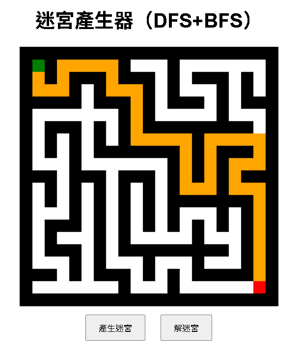

## 走迷宮遊戲

[進入遊戲](https://opming7788.github.io/MazeSolver/MazeSolver.html)

## 使用技術

- HTML5 Canvas：用於繪製迷宮和路徑。
- JavaScript：實現迷宮生成與解迷宮的邏輯。
- CSS：簡單的樣式設計。
- 

## 演算法

### 迷宮生成

- **深度優先搜尋 (DFS)**：
  - 使用遞迴方式生成迷宮。
  - 隨機打亂方向，確保迷宮的隨機性。
  - 每次移動兩格，並打通牆壁形成通路。

### 迷宮解法

- **廣度優先搜尋 (BFS)**：
  - 使用佇列進行層級遍歷。
  - 記錄每個節點的父節點，方便回溯路徑。
  - 將解迷宮的路徑以動畫方式顯示。

## 功能

- 產生迷宮：點擊「產生迷宮」按鈕，生成新的迷宮。
- 解迷宮：點擊「解迷宮」按鈕，顯示從起點到終點的解法路徑。
